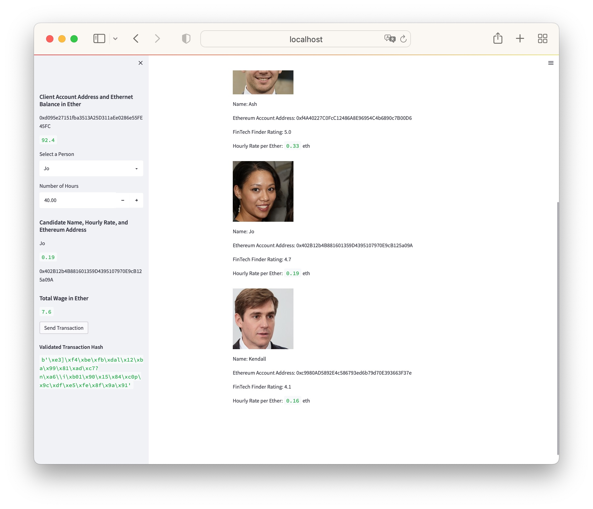

# Blockchain Application 

## Table of Contents

This project is an application that makes use of professional profiles to remit payments for hourly wages in **ETH**. This is a python application developed using the **streamlit** library for the user interface.

To Run this application clone this repo to a local directory. 

```Terminal
git clone git@github.com:mmsaki/blockchain-payment-app.git
```

Get into the git directory through terminal

```
cd blockchain-payment-app
```

To run the application make sure streamlit is installed. If not run `pip install streamlit`

Run app
```
streamlit run fintech_finder.py
```

From your **Ganache** application, copy the mnemonic phrase into a `.env` file and change the profile addresses to send and receive payments to the accounts.

Here is a screenshot of the app run.

